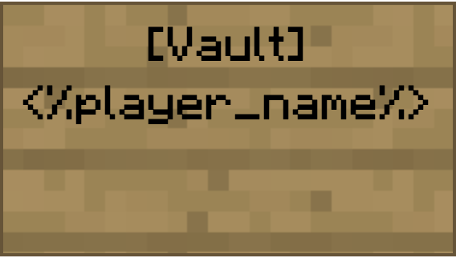

> <span style="color:red">Currently unimplemented.</span>
# Banking
Banking goes hand in hand with the `Market` system as it provides a method for storing players money. We already know from the class [hierarchy](api/hierarchy.md) that there exists player and non player accounts, but this banking system turns them into physical locations and not just hidden away as text in some database.    

## What Are Banks?
A bank is a financial institution licensed to receive deposits and make loans. There are several types of banks including retail, commercial, and investment banks. In most countries, banks are regulated by the national government or central bank.   

The goal is to try and emulate this in game as well. Allowing for [nations](../nodes/nation-system.md) to create their own physical national banks tied directly to their economies, as well as providing the more established NPC nations their own banks as well that can give out loans and financially back and assist the player as a way for them to store their money there until their own nation becomes financially stable.   

## Bank Vaults
The main feature of banks is obviously their money storing capability and this is done through `Vaults`. Vaults are physical chests that players have inside the bank.    

Bank vaults are registered with a chest with a sign placed upon it that reads "[Vault]". Upon right-clicking the sign, it will update to display the name of the player registered to that vault such as this:

    

Vaults can also be registered to other players by typing their names on the second line instead of leaving it blank.   

Nations and settlements also require a vault in-order to store incoming taxes from [taxed transactions](/mech/economy/market.html#taxed-transaction) as well as a way for settlements/nations to pay upkeep in-order to keep their claims from dissolving due to inactivity. To make a vault for a nation, the setup is very similar except the name of the settlement/nation must be printed on the second line.   

Finally, [Companies](companies.md) can also register their own vaults in-order to store profits prior to payday, a source of money in-order to pay off dividends, and as a sort-of shared bank account between trusted employees. To register a company vault, the setup is the same: Place a sign with [Vault] on the first line, the name of the company on the second line, and INC on the third line. 

### Bank Vaults and Balance
On most servers, a player can execute a command such as `/bal` or `/balance` in-order to view how much in-game currency they have. Since we already know that currency will be a physical item (*See*: [Market](market.md)), it will be hard (and very unwise) for players to carry all of their money in their inventory at all times.    

Since bank vaults act as storage for a player's money they should also have some practicality outside of that by displaying the player's combined balance of both the currency in their posession and currency stored elsewhere.   

An example of how this would look like in-game:

```
* player1 executed server command: /balance *

Chat: 

[Balance] {inventory amount, I}
[Vault Balance] {stored vault amount, V}
[Total] {total balance, I + V}
```    

We can look at [Gringotts](https://github.com/nikosgram/gringotts/blob/master/src/main/java/org/gestern/gringotts/GringottsAccount.java) for an example of how they did it:
```java
/**
     * Current balance of this account in cents
     *
     * @return current balance of this account in cents
     */
    public long getBalance() {
        CompletableFuture<Long> cents     = getCents();
        CompletableFuture<Long> playerInv = countPlayerInventory();
        CompletableFuture<Long> chestInv  = countChestInventories();

        // order of combination is important, because chestInv/playerInv might have to run on main thread
        CompletableFuture<Long> f = chestInv
                .thenCombine(playerInv, Long::sum)
                .thenCombine(cents, Long::sum);

        return getTimeout(f);
    }

    /**
     * Current balance this account has in chest(s) in cents
     *
     * @return current balance this account has in chest(s) in cents
     */
    public long getVaultBalance() {
        return getTimeout(countChestInventories());
    }

    ...

    private CompletableFuture<Long> countChestInventories() {
        Callable<Long> callMe = () -> {
            Collection<AccountChest> chests  = dao.retrieveChests(this);
            long                     balance = 0;
            
            for (AccountChest chest : chests) {
                balance += chest.balance();
            }

            Optional<Player> playerOpt = playerOwner();
            if (playerOpt.isPresent()) {
                Player player = playerOpt.get();

                if (Configuration.CONF.useVaultEnderChest && Permissions.USE_VAULT_ENDERCHEST.isAllowed(player)) {
                    balance += new AccountInventory(player.getEnderChest()).balance();
                }
            }
            return balance;
        };

        return callSync(callMe);
    }
```

## Banks (Location)
This system also introduces a chunk plot called a `Bank` (can also be referred to as `Bank Plot` or `Bank Chunk`). Banks are registered when a `Nation Vault` is registered properly within the claims of that nation's capital.   

This plot of land is special as it allows for nation leaders as well as those with the `Banker` [permission](../nodes/nations/permissions.md) to do things such as give out loans to a player.    

### Loans
Loan interest rate is configurable on a per town basis. Interest is compounded weekly.    

In-order for a bank to give a loan, the bank must have that much money stored in a vault in-order to give it out. Once it is given out, the player who receives the loan will have that money transferred to their balance. After the due date for the loan is reached, whatever money in that player's physical vault with that bank will automatically go into paying for their debt.    

If they were to have insufficient funds then that specific vault will have a negative balance and it will be reflected on their total balance. Players can choose simply not to pay back their loan but will still accrue interest until a `Banker` decides to "forgive" the loan.   

Failure to pay off loans in a timely manner will decrease the player's `credit score` which will be viewable to anyone with the `Banker` permissions. 

### Minting Currencies
> 📝 **Note:** This section discusses allowing nations to mint their own currencies which can be exchanged following a global, "dynamic" exchange rate. This is a very complex mechanic and might be hard to implement so it might not be implemented or at least not fully implemented. HUGE WORK IN PROGRESS. Probably should just ignore this section until it gets more fleshed out.  
    
Banks are also used as a means to mint currencies. This option will only be available to large nations (size is configurable) as a way to keep the economy from getting too chaotic.    

#### **Requirements to Mint Currency**
There are a few requirements in-order for nations to mint their own currencies. 

1. Firstly is the size requirement as mentioned earlier; nations must be over a specific (configurable) size in-order to mint their own currency. 
2. Secondly is having `gold` in the bank. This includes ingots as well as nuggets. Currencies must be backed by gold in the bank in-order to be valid. This allows for currencies to be exchanged. 

When the prerequisites are met, nation leaders will able to run a command to register their currency with a name (string) and symbol (char). Once successfully created, the currency will be registered to the global economy. All currencies are backed by the value of the item `gold`. Exchange rates between different currencies will be generated based on a few factors which we will cover later.    

Market stalls in *any* town/nation can be configured to accept any currency they choose that is registered globally. They can also choose to not accept certain currencies at any time of their choosing.    

#### **Exchange Rates**
Currency exchanges between different types of currencies is handled by the bank. When depositing currency to a bank, the bank automatically converts it into the gold equivalent. If a foreign currency is deposited, then that gold is taken out of the original nation's bank into the new one. For example:   
// todo: i ran into some problems when trying to design a thought experiment 