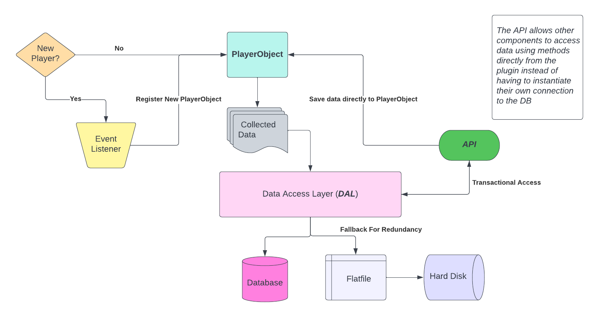

# PlayerStats
`PlayerStats` is one of the core components of the server. It is meant to function as more of a utility rather than a standalone plugin but offers some standalone functionality.
## Overview
The purpose of this plugin is essentially act as a handler that stores statistics of players for use with other components via API.   

On its own without any integration with the other mechanics or plugins in place, `PlayerStats` is capable of storing and returning the following information:    

1. Playtime - Measure of a player's total playtime on the server
2. UUID - Stores Mojang UUID
3. IP - Purely for security reasons to prevent gaming of certain mechanics via the abuse of alternate accounts.
4. Kill/Death Ratio 

With the planned integration with the other mechanics, the database will expand to store the following information as well:   

1. Account balances - From the [Economy](../mech/economy.md)
2. Reputation - Collected through various methods; transactionally through `PlayerCards` as well as through [Cults](../mech/cults.md) when recording player-god relationship status.    

## Structure
This section will outline the structure of the plugin from a programming standpoint. Here is a diagram to help those who are more visual learners:   



### Data Handling
The main component of the plugin is the Data Access Layer (DAL), defined by the `data` package of the plugin. The DAL utilizes two main Data Access Objects (DAO). The first of these DAOs is the `UserDatabase` class, which handles the SQL connection via HikariCP as shown in the code below:

```java
public class UserDatabase {

    private final String HOST = "localhost";
    private final int PORT = 3306;
    private final String DB = "playerstats";
    private final String USER = "root";
    private final String PASS = plugin.getDbPass().getString("db-pass"); // Getter for password from a config.yml in-order to                                                                      maintain proper OPSEC

    private HikariDataSource hikari;

    public void connect() throws SQLException {
        hikari = new HikariDataSource();
        hikari.setDataSourceClassName("com.mysql.jdbc.jdbc2.optional.MysqlDataSource");
        hikari.addDataSourceProperty("serverName", HOST);
        hikari.addDataSourceProperty("port", PORT);
        hikari.addDataSourceProperty("databaseName", DB);
        hikari.addDataSourceProperty("user", USER);
        hikari.addDataSourceProperty("password", PASS);
    }

    public boolean isConnected() { return hikari != null; }

    public HikariDataSource getHikari() { return hikari; }

    public void disconnect() {
        if (isConnected()) {
            hikari.close();
        }
    }
}
```

The second DAO creates a JSON file per user in order to store data in a flatfile primarily for redundancy purposes, in the event that an SQL connection is no longer available or compromised. The use case for this sort of data storage is very limited as it requires components to directly receive data by accessing the `PlayerStats` API rather than accessing the SQL database directly. 